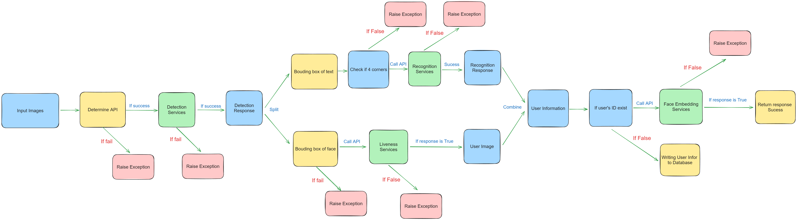

## Luồng dữ liệu
Dữ liệu sẽ đi qua các giai đoạn như hình mô tả trong đường dẫn: 



---

## **Danh mục nội dung**
1. [Router CCCD/CMTND](#router-cccdcmtnd)
    - a. [Trường hợp ảnh không đạt chất lượng](#trường-hợp-ảnh-không-đạt-chất-lượng)
    - b. [Trường hợp ảnh đạt chất lượng](#trường-hợp-ảnh-đạt-chất-lượng)
    - c. [Trường hợp yêu cầu bị từ chối](#trường-hợp-yêu-cầu-bị-từ-chối)
    - d. [Định dạng yêu cầu](#định-dạng-yêu-cầu)
2. [Hướng dẫn thực thi hệ thống](#hướng-dẫn-thực-thi-hệ-thống)
3. [Chú ý](#chú-ý)

---

## Router CCCD/CMTND


### Trường hợp ảnh không đạt chất lượng
```python
{
    "status" : False, 
    "message": "Image is not enough quality.",
    "annotations" : {}
}
```

### Trường hợp ảnh đạt chất lượng

##### b.1. CCCD/CMTND mặt trước:
```python
{
    "status": True,
    "messsage": "Success",
    "annotations": {
        "place_of_origin": "",
        "place_of_residence": "",
        "nationality": "",
        "name": "",
        "id": "",
        "date_of_birth": "",
        "sex": "",
        "data_of_expiry": ""
    }
}
```

**Thông tin chi tiết:**
- **place_of_origin**: quê quán
- **place_of_residence**: nơi thường trú
- **nationality**: Quốc tịch
- **name**: Họ và tên
- **id**: mã số CCCD/CMTND
- **date_of_birth**: Ngày sinh
- **sex**: Giới tính
- **data_of_expiry**: Ngày hết hạn

##### b.2. CCCD/CMTND mặt sau:
```python
{
    "status": true,
    "messsage": "Success",
    "annotations": {
        "issued_date": "30/01/2018"
    }
}
```

**Thông tin chi tiết:**
- **issued_date**: Ngày cấp

### Trường hợp yêu cầu bị từ chối
```python
{
    "status": false,
    "messsage": "Failed",
    "content": "Sorry! Please try again!"
}
```

### Định dạng yêu cầu
- **Image**: Ảnh ở định dạng base64.
- **type_card**: Loại thẻ 
    - 0: cccd
    - 1: cmtnd
- **if_front**: Xác định mặt của thẻ:
    - 0: mặt sau
    - 1: Mặt trước


## Hướng dẫn thực thi hệ thống
Để chạy hệ thống, thực hiện theo các bước sau:

1. Khởi động các container chứa các services :
    ```bash
    cd Card_Reader && docker compose up
    ```

2. Khởi động dịch vụ chính:
    ```bash
    cd main-app && docker compose up
    ```


## Chú ý
**Lưu ý**: Đảm bảo tất cả các dịch vụ được khởi động trước khi gửi yêu cầu đến API."# ekyc" 
